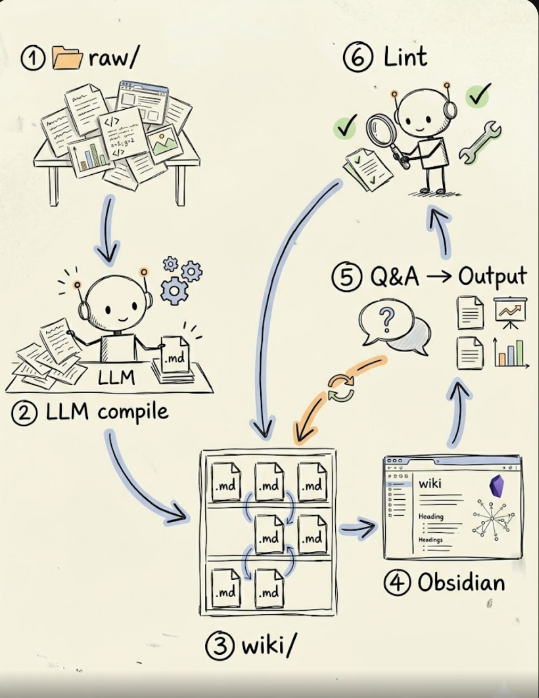
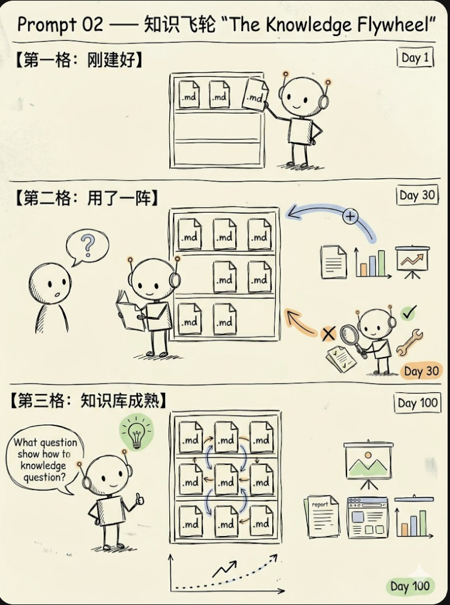
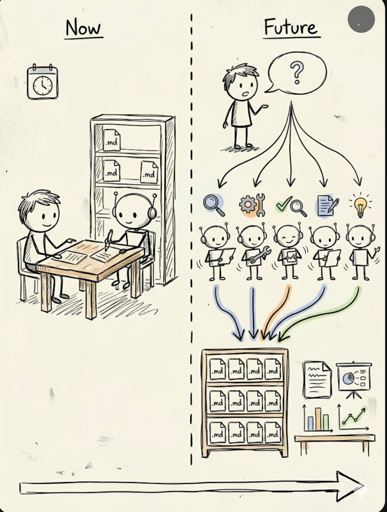

# 🏭 Knowledge Factory

### Karpathy 都在用的 LLM 知识库方法论，我把它做成了一键工具

> **"用 LLM 构建个人知识库，越用越聪明"** — 灵感来自 [Andrej Karpathy 的最新分享](https://x.com/karpathy/status/2039805659525644595)

---

AI 大神 **Andrej Karpathy**（前 Tesla AI 总监、OpenAI 联合创始人）最近公开了他的个人工作流：不再只用 LLM 写代码，而是用 LLM **编译和管理知识**。

他说：

> *"There is room here for an incredible new product instead of a hacky collection of scripts."*

我们把这套方法论做成了 **Claude Code Skill**，开箱即用。

## 💡 Karpathy 的核心方法论

<p align="center">
  
</p>

1. **数据摄入** — 论文、文章、代码、数据扔进 `raw/`，LLM 自动编译成互相关联的 Wiki
2. **Obsidian 查看** — 用 Obsidian 作为"IDE 前端"，浏览知识库的全部内容
3. **问答** — 对知识库提问，LLM 研究后输出报告、幻灯片、图表
4. **知识飞轮** — 输出归档回 Wiki，越用越丰富，复利效应
5. **Linting** — LLM 自动巡检：找矛盾、补缺口、发现新关联
6. **未来** — 一个问题触发一支 LLM 军团，自动构建完整知识库

### 知识飞轮：越用越聪明

<p align="center">
  
</p>

### 未来：从一人一机到 LLM 军团

<p align="center">
  
</p>

> Karpathy: *"Way beyond a `.decode()`"*

## 🚀 快速开始

### 安装

将 `knowledge-factory/` 目录复制到你的 Claude Code skills 目录：

```bash
# 方法一：克隆仓库 + 软链接（推荐，方便更新）
git clone https://github.com/chenly255/knowledge-factory.git
ln -s $(pwd)/knowledge-factory/knowledge-factory ~/.claude/skills/knowledge-factory

# 方法二：直接复制
cp -r knowledge-factory/knowledge-factory ~/.claude/skills/knowledge-factory
```

### 使用

在 Claude Code 中：

```
/knowledge-factory init          # 初始化知识工厂
/knowledge-factory ingest        # 把 raw/ 里的资料编译进 wiki
/knowledge-factory qa "问题"     # 对知识库提问
/knowledge-factory lint          # 健康检查
/knowledge-factory output "主题" # 生成报告/幻灯片
/knowledge-factory compile       # 全量重新编译
```

或者直接用自然语言：

```
"帮我整理 raw/ 里的论文到知识库"
"知识库里关于 attention mechanism 有什么信息？"
"检查一下知识库的健康状况"
"根据知识库帮我生成一份关于 transformer 的报告"
```

## 📁 项目结构

```
your-project/
├── raw/                    # 你的原始素材（论文、文章、代码...）
├── wiki/                   # LLM 编译的知识库（自动维护）
│   ├── _index.md           # 主索引：所有文章 + 一行摘要
│   ├── _graph.md           # Backlink 图谱
│   ├── concepts/           # 概念文章（自动分类）
│   └── sources/            # 源文档摘要（每个 raw 文件一篇）
├── output/                 # 生成的交付物
│   ├── reports/            # Markdown 报告
│   ├── slides/             # Marp 幻灯片
│   └── charts/             # 图表
└── .kf.md                  # 项目配置
```

## 🔧 内置工具

| 工具 | 用途 |
|------|------|
| `scripts/search.py` | BM25 搜索引擎，CLI 和 JSON 两种输出模式 |
| `scripts/index.py` | 自动生成索引和 backlink 图谱 |

## 🎯 设计哲学

引用 Karpathy 的原话：

> *"The LLM writes and maintains all of the data of the wiki, I rarely touch it directly."*

**Wiki 是 LLM 的领地。** 你只需要：
- 投喂素材到 `raw/`
- 提出问题
- 审阅输出

LLM 负责：编译、组织、链接、巡检、生长。

## 🌟 致谢

本项目完全基于 [Andrej Karpathy 的 LLM Knowledge Bases 方法论](https://x.com/karpathy/status/2039805659525644595)。如果你觉得这个想法很棒，请去给 Karpathy 的原帖点个赞。

## 📄 License

MIT
