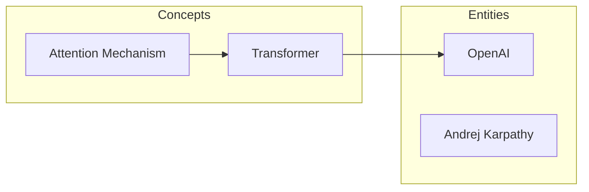

# LLM Wiki

### Karpathy 都在用的 LLM 知识库方法论，我把它做成了一键工具

> **"用 LLM 编译个人知识库，越用越聪明"** — 灵感来自 [Andrej Karpathy 的最新分享](https://x.com/karpathy/status/2039805659525644595)

---

AI 大神 **Andrej Karpathy**（前 Tesla AI 总监、OpenAI 联合创始人）公开了他的个人工作流：不再只用 LLM 写代码，而是用 LLM **编译和管理知识**。

他说：

> *"There is room here for an incredible new product instead of a hacky collection of scripts."*

我们把这套方法论做成了 **Claude Code Skill**——开箱即用，零配置，零依赖。

## 一句话理解

收藏了 100 篇论文 / 50 条推文 / 20 篇公众号文章，但从来没有系统整理过？

**丢进去，AI 帮你自动编译成一个结构化知识库。然后你提问、出报告，知识库越用越大。**

## 完整工作流

```
📄 你的资料                    🤖 AI 编译                📚 知识库
论文/文章/代码/推文/网页  ──→  提炼概念+写摘要+建关联  ──→  结构化 wiki + Mermaid 图谱
                                                            │
           ┌────────────────────────────────────────────────┘
           ↓
     💬 你提问 ──→ 🤖 AI 研究 ──→ 📊 输出报告/图表/幻灯片
                                        │
                                        ↓
                                 📚 归档回知识库（越用越大！）
                                        │
                                        ↓
                            🔍 AI 自动巡检（找错·补缺·发现新关联）
                                        │
                                        ↓
                            ✅ 信任审核（kepano 隔离原则）
```

**7 个环节，覆盖 Karpathy 原文的完整闭环：**

| 环节 | 做什么 | 你需要做的 |
|------|--------|-----------|
| ① 多模态摄入 | 论文/文章/代码/网页/推文/公众号 全丢进 inbox | 丢文件或贴链接 |
| ② 智能编译 | AI 提炼概念、实体、跨文档关联，生成 Mermaid 知识图谱 | 一键触发 |
| ③ 浏览 | 用 Obsidian 或任意编辑器查看 wiki + Mermaid 图谱 | 看 |
| ④ 问答 | 对知识库提问，AI 研究后输出 | 问 |
| ⑤ 知识飞轮 | 输出自动归档回 wiki，越用越大 | 什么都不用做 |
| ⑥ 巡检 | AI 找矛盾、补缺、发现新关联、修复断裂链接 | 一键触发 |
| ⑦ 信任 | 人工审核后导出到 trusted vault，kepano 隔离原则 | 审阅+确认 |

> Karpathy: *"Way beyond a `.decode()`"*

## 核心特性

### 多模态知识摄入

不只是本地文件——**网页、推文、公众号文章、论文链接**都能直接丢进 inbox：

| 数据类型 | 格式 | 处理方式 |
|---------|------|---------|
| 论文/文章 | PDF, MD, TXT | 直接读取 |
| 代码/笔记 | PY, IPYNB | 直接读取 |
| 网页/博客 | URL | MCP 自动提取 Markdown |
| X/Twitter | URL | 自动提取（失败时提示手动复制） |
| 微信公众号 | URL | 自动提取 |
| YouTube | URL | 提示用户粘贴字幕/摘要 |

把 URL 列表存成 `.txt` 文件扔进 inbox，digest 自动批量处理。不需要装 Chrome 插件，不需要额外工具——利用 Claude Code 内置的 MCP 工具链搞定一切。

### Mermaid 知识图谱

每次 `compile` 自动生成 **Mermaid 格式的知识图谱**，直接在 Obsidian 中渲染：



概念和实体自动分组、自动连线，越编译越密。

### Obsidian 原生兼容

`wiki/` 目录可以直接作为 **Obsidian Vault** 打开：
- `[[wiki-link]]` 原生渲染
- Mermaid 图谱原生支持
- 图谱视图（Graph View）直接可用
- `trusted/` 作为你日常使用的干净 vault

### 智能内容分级

根据内容长度自动选择处理策略：
- **>1000 字**：完整摘要（Summary + Concepts + Entities + Facts + Quotes）
- **≤1000 字**：精简摘要（Summary + Concepts），避免给短内容注水

### 全链路操作日志

每次操作自动记录到 `log.md`——什么时候 digest 了什么、compile 生成了哪些新概念、trust 了哪些文章。知识库的 git log。

### 8 个子命令

```
/llm-wiki init my-research   # 初始化知识库项目
/llm-wiki digest             # 消化 inbox（文件 + URL）
/llm-wiki compile            # 编译 wiki + Mermaid 图谱
/llm-wiki query "问题"        # 对知识库提问
/llm-wiki check              # 健康检查
/llm-wiki export "主题"       # 生成报告/幻灯片
/llm-wiki trust              # 信任审核导出
/llm-wiki status             # 知识库状态总览
```

也支持自然语言——不需要记命令：

```
"帮我建一个知识库"
"消化 inbox 里的新论文和链接"
"编译知识库"
"知识库里关于 attention mechanism 有什么信息？"
"检查一下知识库健康状况"
"知识库什么状态了？"
```

## 快速开始

### 安装（10 秒）

**方法一：跟 Claude Code 说（最简单）**

```
帮我安装 llm-wiki skill：从 https://github.com/chenly255/llm-wiki.git 克隆到本地，然后软链接 llm-wiki/llm-wiki 到 ~/.claude/skills/llm-wiki
```

**方法二：一键脚本**

```bash
git clone https://github.com/chenly255/llm-wiki.git ~/.claude/skills/_llm-wiki-repo && \
ln -s ~/.claude/skills/_llm-wiki-repo/llm-wiki ~/.claude/skills/llm-wiki
```

### 使用

```
/llm-wiki init my-research
```

然后把论文、文章、URL 列表丢进 `raw/inbox/`，开始编译你的知识库。

## 目录结构

```
your-project/
├── raw/
│   ├── inbox/              # 丢新资料到这里（文件 + URL 列表）
│   └── sources/            # 已消化的原始文件
├── wiki/                   # AI 编译的知识库
│   ├── _index.md           # 主索引
│   ├── _graph.md           # 关联图谱 + Mermaid 知识图谱
│   ├── concepts/           # 概念文章（想法、方法、模式）
│   ├── entities/           # 实体文章（人物、工具、组织）
│   └── sources/            # 原文摘要
├── output/                 # AI 生成的交付物（报告/幻灯片）
├── trusted/                # 你审核通过的内容
├── log.md                  # 操作日志
└── .kf.md                  # 项目配置
```

## 设计理念

### Karpathy 的编译哲学

> *"The LLM writes and maintains all of the data of the wiki, I rarely touch it directly."*

知识库是 AI 的领地，不是你的。你只管丢素材、提问题、审输出。

### kepano 的隔离原则

> AI 生成的内容和人类信任的知识必须分开。

`wiki/` 是 AI 的草稿区，可能有幻觉。`trusted/` 是你逐篇审核后导出的——可以放心拿去做决策。

### 零外部依赖

不需要装 Chroma、Pinecone、LlamaIndex。不需要向量数据库。不需要 Chrome 插件。只需要 **Claude Code + Markdown 文件**。

~100 篇文档的规模下，BM25 搜索 + LLM 推理足够了。Karpathy 也这么说。

## 内置工具

| 工具 | 用途 |
|------|------|
| `scripts/search.py` | BM25 搜索引擎，快速定位相关文章 |
| `scripts/index.py` | 自动生成索引 + Mermaid 知识图谱 |

## 致谢

- [Andrej Karpathy](https://x.com/karpathy/status/2039805659525644595) — LLM Knowledge Bases 方法论
- [kepano](https://x.com/kepano) — AI 内容隔离原则
- [sdyckjq-lab/llm-wiki-skill](https://github.com/sdyckjq-lab/llm-wiki-skill) — URL 摄入 & Mermaid 图谱的灵感来源

## License

MIT
