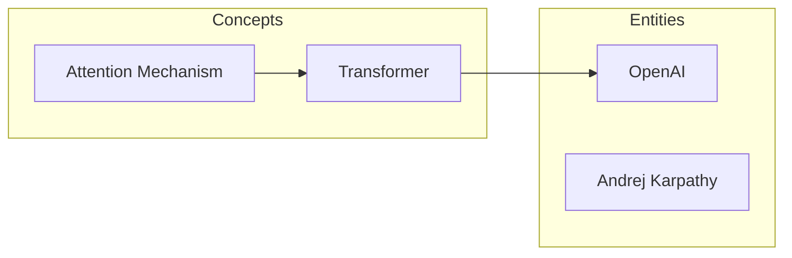

# LLM Wiki

### The LLM Knowledge Base workflow Karpathy uses — now a one-command tool

> **"Build personal knowledge bases with LLMs that get smarter the more you use them"** — Inspired by [Andrej Karpathy's latest post](https://x.com/karpathy/status/2039805659525644595)

---

**Andrej Karpathy** (former Tesla AI Director, OpenAI co-founder) recently shared his personal workflow: instead of using LLMs just to write code, he uses them to **compile and manage knowledge**.

He said:

> *"There is room here for an incredible new product instead of a hacky collection of scripts."*

We turned this methodology into a **Claude Code Skill** — ready to use out of the box, zero config, zero dependencies.

## The Idea in One Sentence

Ever saved 100 papers / 50 tweets / 20 blog posts and never organized them?

**Dump them in. AI compiles a structured knowledge base. You ask questions, get reports. It grows.**

## The Full Workflow

```
📄 Your stuff                        🤖 AI compiles              📚 Knowledge base
papers/articles/code/tweets/urls ──→ extract concepts+links  ──→ structured wiki + Mermaid graph
                                                                   │
           ┌───────────────────────────────────────────────────────┘
           ↓
     💬 You ask ──→ 🤖 AI researches ──→ 📊 reports / charts / slides
                                             │
                                             ↓
                                      📚 archived back (grows!)
                                             │
                                             ↓
                                🔍 AI auto-lints (fix · fill · discover)
                                             │
                                             ↓
                                ✅ Trust review (kepano isolation principle)
```

**7 stages, covering Karpathy's full loop:**

| Stage | What happens | What you do |
|-------|-------------|-------------|
| ① Multimodal ingest | Papers/code/webpages/tweets/blogs go into inbox | Drop files or paste URLs |
| ② Smart compile | AI extracts concepts, entities, cross-doc links + Mermaid graph | One click |
| ③ Browse | View wiki + Mermaid graphs in Obsidian or any editor | Read |
| ④ Q&A | Ask questions, AI researches and outputs answers | Ask |
| ⑤ Flywheel | Outputs auto-archive back into wiki, it grows | Nothing |
| ⑥ Lint | AI finds contradictions, fills gaps, discovers connections | One click |
| ⑦ Trust | Human review → export to trusted vault | Review + confirm |

> Karpathy: *"Way beyond a `.decode()`"*

## Core Features

### Multimodal Knowledge Ingestion

Not just local files — **webpages, tweets, paper links** all go straight into inbox, batch-digested in one command:

| Source | Extraction | Status |
|--------|-----------|--------|
| PDF / Local files | Read tool direct extract (zero config); optional [pymupdf4llm](https://github.com/pymupdf/pymupdf4llm) / [MinerU](https://github.com/opendatalab/MinerU) for high-fidelity | ✅ Supported |
| Code / Notes (PY, IPYNB) | Direct read | ✅ Supported |
| Plain text paste | Direct use | ✅ Supported |
| Webpages / Blogs / Medium | web_reader auto-extracts Markdown | ✅ Supported |
| X / Twitter | web_reader auto-extracts | ✅ Supported |
| GitHub / GitLab repos | GitHub MCP extracts tree + README + key code, LLM generates structured overview | ✅ Supported |
| YouTube | web_reader extracts metadata (title/chapters/description) | ⚠️ Partial (transcripts TBD) |
| WeChat Articles | tavily_extract (requires production key) | 🔧 Pending |
| Zhihu | Anti-scraping block, suggest manual copy | 🔧 TBD |
| Xiaohongshu | Install [xiaohongshu-mcp](https://github.com/xpzouying/xiaohongshu-mcp) (free, needs Cookie) | 🔧 Available |

Save URL lists as `.txt` files in inbox, digest handles them in batch. Most scenarios require zero extra tools — powered by Claude Code's built-in MCP toolchain.

### Mermaid Knowledge Graph

Every `compile` auto-generates a **Mermaid knowledge graph**, renders natively in Obsidian:



Concepts and entities auto-grouped, auto-linked. Gets denser with every compile.

### Obsidian Native Compatibility

Open `wiki/` directory directly as an **Obsidian Vault**:
- `[[wiki-links]]` render natively
- Mermaid graphs supported out of the box
- Graph View works immediately
- `trusted/` as your clean daily-use vault

### Smart Content Tiers

Auto-selects processing depth based on content length:
- **>1000 chars**: Full summary (Summary + Concepts + Entities + Facts + Quotes)
- **≤1000 chars**: Brief summary (Summary + Concepts only), no padding

### Full Operation Log

Every operation auto-logged to `log.md` — what was digested, which concepts were compiled, which articles were trusted. A git log for your knowledge base.

### 8 Subcommands

```
/llm-wiki init my-research   # Initialize a project
/llm-wiki digest             # Digest inbox (files + URLs)
/llm-wiki compile            # Build wiki + Mermaid graph
/llm-wiki query "question"   # Query the knowledge base
/llm-wiki check              # Health check
/llm-wiki export "topic"     # Export reports/slides
/llm-wiki trust              # Trust review & export
/llm-wiki status             # Knowledge base overview
```

Also supports natural language — no need to memorize commands:

```
"Help me set up a knowledge base"
"Digest the new papers and links in inbox"
"Compile the knowledge base"
"What does the knowledge base say about attention mechanisms?"
"Run a health check"
"What's the status of my knowledge base?"
```

## Quick Start

### Install (10 seconds)

**Option 1: Just tell Claude Code (easiest)**

```
Install the llm-wiki skill: clone https://github.com/chenly255/llm-wiki.git and symlink llm-wiki/llm-wiki to ~/.claude/skills/llm-wiki
```

**Option 2: One-liner**

```bash
git clone https://github.com/chenly255/llm-wiki.git ~/.claude/skills/_llm-wiki-repo && \
ln -s ~/.claude/skills/_llm-wiki-repo/llm-wiki ~/.claude/skills/llm-wiki
```

### Usage

```
/llm-wiki init my-research
```

Then drop papers, articles, URL lists into `raw/inbox/` and start compiling.

## Project Structure

```
your-project/
├── raw/
│   ├── inbox/              # Drop new materials here (files + URL lists)
│   └── sources/            # Processed originals
├── wiki/                   # AI-compiled knowledge base
│   ├── _index.md           # Master index
│   ├── _graph.md           # Link graph + Mermaid knowledge graph
│   ├── concepts/           # Concept articles (ideas, methods, patterns)
│   ├── entities/           # Entity articles (people, tools, orgs)
│   └── sources/            # Source summaries
├── output/                 # AI-generated deliverables (reports/slides)
├── trusted/                # Human-approved content
├── log.md                  # Operation log
└── .kf.md                  # Project config
```

## Design Philosophy

### Karpathy's Compilation Philosophy

> *"The LLM writes and maintains all of the data of the wiki, I rarely touch it directly."*

The wiki is the AI's domain, not yours. You drop materials, ask questions, review outputs.

### kepano's Isolation Principle

> AI-generated content and human-trusted knowledge must be kept separate.

`wiki/` is the AI's draft zone — may contain hallucinations. `trusted/` is your逐篇-reviewed export — safe for decision-making.

### Zero External Dependencies

No Chroma, no Pinecone, no LlamaIndex. No vector databases. No Chrome plugins. Just **Claude Code + Markdown files**.

At ~100 docs scale, BM25 search + LLM reasoning is enough. Karpathy said so too.

## Built-in Tools

| Tool | Purpose |
|------|---------|
| `scripts/search.py` | BM25 search engine for fast article lookup |
| `scripts/index.py` | Auto-generates index + Mermaid knowledge graph |

## Credits

- [Andrej Karpathy](https://x.com/karpathy/status/2039805659525644595) — LLM Knowledge Bases methodology
- [kepano](https://x.com/kepano) — AI content isolation principle
- [sdyckjq-lab/llm-wiki-skill](https://github.com/sdyckjq-lab/llm-wiki-skill) — Inspiration for URL ingestion & Mermaid graphs

## License

MIT
