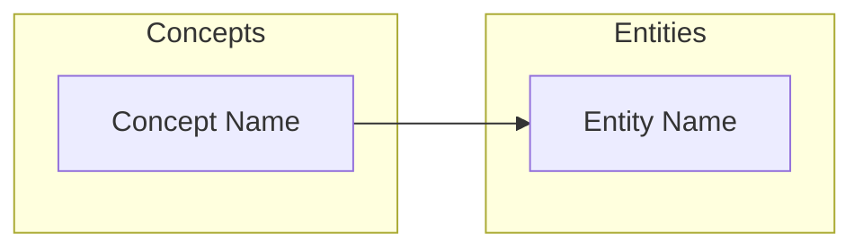

# Wiki Conventions — LLM Wiki

> Reference document for consistent wiki formatting.

## File Naming

- **Concept articles:** `wiki/concepts/{lowercase-kebab-case}.md`
  - Example: `wiki/concepts/neural-network.md`, `wiki/concepts/attention-mechanism.md`
- **Entity articles:** `wiki/entities/{lowercase-kebab-case}.md`
  - Example: `wiki/entities/andrej-karpathy.md`, `wiki/entities/obsidian.md`
- **Source summaries:** `wiki/sources/{lowercase-kebab-case}.md`
  - Example: `wiki/sources/karpathy-llm-knowledge-bases.md`
- **Meta files (auto-managed):** `wiki/_index.md`, `wiki/_graph.md`
  - Prefix with `_` to sort first and signal "don't edit manually"

## What Is a Concept vs an Entity?

| Type | What it is | Examples |
|------|-----------|---------|
| **Concept** | An idea, method, pattern, or technique | knowledge-flywheel, attention-mechanism, backpropagation |
| **Entity** | A specific person, tool, org, dataset, or product | andrej-karpathy, obsidian, openai, imagenet |

Rule of thumb: if it has a Wikipedia page as a proper noun, it's an entity. If it's an abstract idea, it's a concept.

## Article Formats

### Concept Article

```markdown
# {Concept Name in Title Case}
> Auto-compiled by llm-wiki.

## Overview
{2-5 sentences synthesizing what this concept is, drawn from all sources}

## Key Points
- {Important point 1}
- {Important point 2}

## Sources
- [[sources/{source-a}]]: {what this source says about the concept}
- [[sources/{source-b}]]: {what this source says about the concept}

## Related Concepts
- [[{related-concept}]]: {brief description of relationship}

## Related Entities
- [[{related-entity}]]: {brief description of relationship}
```

### Entity Article

```markdown
# {Entity Name}
> Auto-compiled by llm-wiki.
> Type: {person|tool|organization|dataset|product|other}

## Overview
{Who/what this is, synthesized from all sources}

## Mentioned In
- [[sources/{source-a}]]: {context of mention}

## Related Concepts
- [[{concept}]]: {how this entity relates to the concept}

## Related Entities
- [[{other-entity}]]: {relationship description}
```

### Source Summary (Local File)

```markdown
# {Document Title}
> Source: `raw/sources/{filename}`
> Ingested: {YYYY-MM-DD}
> Type: {paper|article|code|dataset|other}
> Status: digested (pending compile)

## Summary
{3-5 sentence summary of the entire document}

## Key Concepts
- [[{concept-a}]]: {how this document relates to the concept}
- [[{concept-b}]]: {how this document relates to the concept}

## Key Entities
- [[{entity-a}]]: {how this document relates to the entity}

## Key Facts
- {Fact 1}
- {Fact 2}

## Quotes / Key Passages
> {Notable quote or passage, with attribution if applicable}
```

### Source Summary (URL)

```markdown
# {Page Title}
> Source: {url}
> Ingested: {YYYY-MM-DD}
> Type: {tweet|blog|video|article|other}
> Status: digested (pending compile)

## Summary
{3-5 sentence summary}

## Key Concepts
- [[{concept-a}]]: {relevance}

## Key Entities
- [[{entity-a}]]: {relevance}

## Key Facts
- {fact 1}

## Quotes / Key Passages
> {notable passage from the URL content}
```

### Source Summary (Simplified — ≤1000 chars content)

For short documents or failed extractions with minimal content, use a brief format:

```markdown
# {Title}
> Source: {path or url}
> Ingested: {YYYY-MM-DD}
> Type: {type}
> Status: digested (pending compile)

## Summary
{2-3 sentence summary}

## Key Concepts
- [[{concept}]]: {relevance}
```

## Cross-Reference Syntax

Use `[[wiki-link]]` syntax:

- `[[concept-name]]` — links to `wiki/concepts/concept-name.md`
- `[[entity-name]]` — links to `wiki/entities/entity-name.md`
- `[[sources/source-name]]` — links to `wiki/sources/source-name.md`
- Use the name only (not file path) for concept/entity links
- Always use `sources/` prefix for source links to avoid ambiguity

## Index Format (_index.md)

```markdown
# Knowledge Index
> Auto-maintained by llm-wiki. Do not edit manually.

## Statistics
- Total articles: N
- Concepts: N
- Entities: N
- Source summaries: N
- Total words: ~N
- Last updated: YYYY-MM-DD HH:MM

## Concepts
- [[concept-a]] — one-line summary (N refs)

## Entities
- [[entity-a]] — one-line summary (N refs)

## Sources
- [[sources/source-a]] — one-line summary
```

## Graph Format (_graph.md)

`_graph.md` contains two sections:

1. **Link Map table** — auto-generated by `index.py`, shows backlinks, broken links, and orphans.
2. **Knowledge Graph** — a Mermaid diagram for visual browsing in Obsidian.

```markdown
# Backlink Graph
> Auto-maintained by llm-wiki. Do not edit manually.

## Link Map
| Article | Links to | Linked from |

## Broken Links
- `[[missing-link]]` in source

## Orphan Articles (no links in or out)
- orphan-article.md

## Knowledge Graph

```

## Log Format (log.md)

Operation log tracking all wiki changes:

```markdown
# Operation Log

[2026-04-05 10:30] init: Project "llm-research" created at /path/to/project
[2026-04-05 10:35] digest: processed 3 files, 2 URLs (0 failed)
- Sources: karpathy-llm-kb, attention-is-all-you-need, transformer-paper, karpathy-tweet-123
[2026-04-05 10:40] compile: 12 concepts, 5 entities, 5 sources
- New: attention-mechanism, transformer, knowledge-flywheel, ...
- Updated: (none)
[2026-04-05 11:00] query: "what is attention" → 8 results, answer saved: yes
[2026-04-05 11:15] check: score 85/100, 2 issues found, 2 auto-fixed
[2026-04-05 11:20] trust: 3 articles approved → trusted/
- attention-mechanism.md, transformer.md, knowledge-flywheel.md
```

## Content Processing Tiers

| Content Length | Processing | Sections in Source Summary |
|---------------|-----------|--------------------------|
| >1000 chars | Full | Summary + Key Concepts + Key Entities + Key Facts + Quotes |
| ≤1000 chars | Simplified | Summary + Key Concepts only |

## Obsidian Compatibility

The wiki directory is Obsidian-compatible:
- All `[[wiki-links]]` render natively in Obsidian.
- Mermaid graphs in `_graph.md` render via the built-in Mermaid plugin.
- Open `wiki/` as an Obsidian vault for visual graph view.
- Use `trusted/` as a clean, human-approved vault for daily note-taking.

## Writing Guidelines

1. **Synthesize, don't copy.** Wiki articles should distill and connect information, not reproduce raw text.
2. **One topic per article.** If a concept is too broad, split it.
3. **Always cite sources.** Every claim should trace back to a source summary.
4. **Use consistent terminology.** If two sources use different terms for the same thing, pick one and note the alias.
5. **Update, don't duplicate.** Merge new info into existing articles rather than creating parallel ones.
6. **Keep summaries fresh.** When an article grows, update its one-line summary in `_index.md`.
7. **Concepts vs Entities.** Don't mix them — a person is an entity, their method is a concept.
